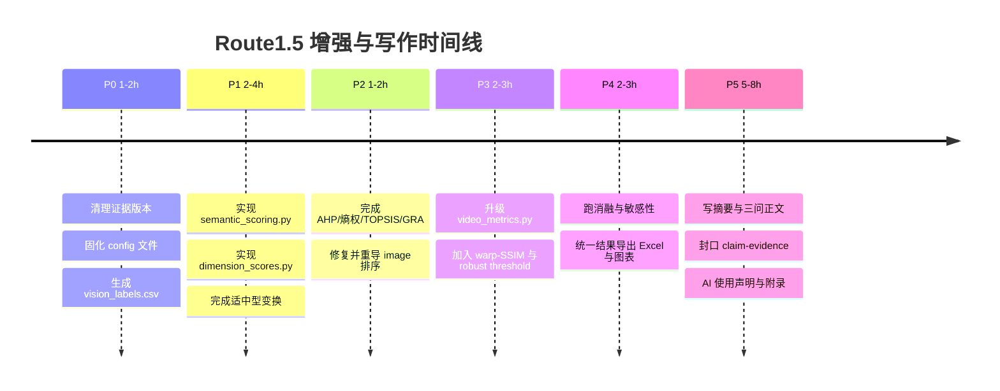

# OpenCode Route1.5 建模方案深度评估与增强蓝图

## 执行摘要

结论先行：**Route1.5 是正确骨架，但以当前可核查工件状态，它还不足以稳冲中青杯头部论文；它离“高质量可提交”很近，离“顶级”差的并不是再叠一个模型，而是把语义量化、指标单调化、证据闭环、鲁棒验证和参数优化形式化补齐。** 你的方向已经与近两年 AIGC 质量评估研究的主流脉络对齐：AIGCIQA2023 将 AIGC 图像评价拆成质量、真实性与对应性；AGIQA-3K 将感知质量与文图对齐分开建模；VBench 与 STREAM 则明确提示视频不能把空间质量与时间质量混成一个值来讲。Route1.5 中“语义—技术—结构”三维图像评价与“视频时序失稳”分支，本质上是走在正确路上的。citeturn27academia2turn28academia0turn27academia0turn17academia1

但从“论文能否拿高奖”的角度看，**当前短板非常集中**。我在本会话里直接核读了 `image_metrics.csv`、`image_scores.csv`、`results.xlsx` 和 `smoke_test_report.txt`；其中 `results.xlsx` 仍是旧版中间工件，只含图像相关工作表，没有视频工作表，且图像排序还保留了旧 rank；因此它不能直接充当终稿证据工作簿。与此同时，归档 smoke test 仍显示 FFmpeg 不可用，且依赖列表没有 `torch/transformers`，说明 archive 中混有过时环境证明，多模态与 final 环境必须单独重导。fileciteturn0file0

所以，本报告给出的判断是：**不要推翻 Route1.5，应该做的是“定主线、补定义、补证据、补验证、补写法”。** 最重要的增强点只有四类：其一，把“没有原始 prompt 的语义保真度”改写成“等效语义参考描述 + 结构化标签 + CLIP/BLIP 交叉检查”的可复现分数；其二，把亮度/饱和度类指标做成“适中型单调化”，并把 `noise_estimate` 从主评分中移除或至少只保留为诊断量；其三，视频时序部分加入**光流补偿后的 warp-SSIM 失稳项**，让异常帧解释不只靠帧差和普通 SSIM；其四，把“参数优化建议表”升级为一个明确的**短板—参数优先级模型**。完成这四件事后，Route1.5 就有机会从“骨架正确”提升为“高奖可竞争方案”。citeturn11academia0turn18academia0turn18academia1turn18academia2turn29academia1turn29academia0

## 当前方案的充分性评估

先说明证据边界：本报告对 `image_metrics.csv`、`image_scores.csv`、`results.xlsx` 做了文件级核读；对 `final_modeling_plan.md`、`claim_evidence_map.md`、`innovation_points.md`、`vision_review.md` 和 `video_metrics.csv` 的判断，则依据你在前几轮对话中给出的摘要与结论进行方法学审阅。也就是说，**我能对图像指标与老版工作簿做“硬核对”，对文档方案做“结构性审阅”，对视频 CSV 则做“方案层审阅”而非数值逐行复核**。

| 工件 | 当前价值 | 主要问题 | 对顶级论文的影响 |
|---|---|---|---|
| `final_modeling_plan.md` | 主线清楚，已选对“稳健型主框架 + 轻量增强”的方向 | 语义维度定义仍偏松；AHP 权重与参数优化尚未完全形式化 | 高 |
| `claim_evidence_map.md` | 已经建立“结论必须落证据”的意识，方向很好 | 存在 claim 与旧版结果文件不同步的风险 | 高 |
| `innovation_points.md` | 三个创新点方向都对 | 目前更像“创新表述”，还不是“创新实验” | 中高 |
| `vision_review.md` | 多模态审查完成，能为语义/结构维度提供高价值标签 | 仍是 Markdown 叙述，不是机器可复现评分表 | 高 |
| `image_metrics.csv` | 低层技术指标可复现、无需额外数据 | 指标方向性不稳，部分指标意义重叠或误判 | 高 |
| `video_metrics.csv` | 现有指标集已覆盖帧差、闪烁、光流，方向正确 | 当前会话未拿到原 CSV；阈值与“自然运动 vs 伪影”分离仍偏弱 | 中高 |
| `results.xlsx` | 可视化整合意识强 | 当前上传版本仍是旧版：无 video sheets、排序旧、不能做终稿 evidence | 高 |

Route1.5 的**方法学优点**是明确的。AIGCIQA2023 与 AGIQA-3K 都表明，AIGC 图像质量不能只用“清晰/不清晰”来讲，而要把至少两个层面分开：一是感知质量，二是语义/文本对应；AGHI-QA 进一步显示，对于人像或复杂主体，单一全局分数还不够，扭曲的身体部位与局部结构标签本身就是信息。也就是说，你们提出“语义保真度 + 技术质量 + 结构完整性”的三维框架，在研究范式上是站得住的。citeturn27academia2turn28academia0turn28academia1

真正的问题出在“**三维框架如何落成可重复的数值**”。当前最硬的几个风险如下。第一，**语义维度缺原始提示词**。如果继续把它写成“prompt 符合度”，评委很容易追问“题目并没提供真实 prompt，你怎么知道它偏没偏？” 第二，**TOPSIS 的单调性前提还没被彻底满足**。TOPSIS 假定进入模型的指标都已转成“越大越好”或“越小越好”的单调指标；而你当前工作簿里 `brightness_std`、`saturation_mean`、`saturation_std` 仍按 Positive 处理，这在评价图像自然度时是危险的。第三，**`noise_estimate` 的方向和含义出了问题**：我对当前 8 图做了 Spearman 核查，`noise_estimate` 与现有 closeness 的相关系数约为 **+0.905**，几乎和 `laplacian_var` 一样正相关，这说明它在当前数据上更像“细节/纹理残差”而不是“越大越差的噪声”。第四，**`results.xlsx` 仍是过渡工件**：它只有 4 个图像工作表，没有视频成果页，也还带着旧排序，这会直接制造 claim–evidence mismatch。TOPSIS 对单调化的依赖是方法论硬条件，不是写作细节。citeturn23search0

更关键的是，**AHP-熵权-TOPSIS 本身不是创新点**。它是一条成熟且常用的多指标决策链路；近年的 EW-TOPSIS、灰关联-TOPSIS、AHP-TOPSIS 组合已经很多。对于中青杯这种比赛，评委不会因为你用了 AHP、熵权法、TOPSIS 就自然给高分；他们更在意的是：你为什么这样分维度，为什么这些指标单调化合理，为什么结论和图表一致，为什么模型变化时结论不崩。也就是说，**创新必须落在“维度定义 + 指标构造 + 验证闭环”上，而不是落在“再堆一个决策模型名字”上。** citeturn23search0turn19academia3

视频部分的判断也类似。你现在的指标集——`ssim_prev`、帧差、亮度变化、饱和度变化、光流幅值、光流方向变化——已经覆盖了 VBench 所关心的“运动平滑”“时序闪烁”这类核心维度，方向没有走偏；但要冲高奖，还差一个关键动作：**把“自然运动引起的差异”和“生成失稳引起的差异”分开**。最新视频评测工作反复强调，应当分离空间与时间维度，而且时间维度不能只看像素差，还要看跨帧身份/外观一致性与运动合理性；VBench 甚至把时间质量分解成 subject consistency、motion smoothness、temporal flickering 等细项，VBench-2.0 进一步加入 human fidelity 与 physics。你当前方案已经碰到前两项，但还没有显式做“运动补偿后再比较”。citeturn27academia0turn27academia3turn17academia1

因此，站在“中青杯头部论文”的标准上，我的判断是：**当前方案作为骨架已经足够，但当前工件状态和形式化程度还不够。** 如果现在立刻写正文，论文大概率会呈现出“框架不错、证据略散、创新有味道但不够硬”的状态；如果先把下面的增强方案全部落地，再把 `results/final` 和 `figures/final` 一次性重导，质量会明显跨一级。

## 文献扫描与可吸收方法

这道题最值得吸收的，不是泛泛的“数学建模论坛口诀”，而是近两年 AIGC 质量评估与视频评测的主干论文。公开中文论坛与中文站点关于中青杯本身的可检索价值比较有限，而真正可操作的方法几乎都在原始论文、开源 benchmark 和官方项目页里。因此，下面这组来源应作为**优先阅读源**。

### 优先来源与应吸收点

| 类别 | 关键来源 | 最该吸收的思想 | 对 Route1.5 的用途 |
|---|---|---|---|
| AIGC 图像质量维度 | AIGCIQA2023、AGIQA-3K | 感知质量与对应性/真实性应分开评估 | 证明三维框架合理，不要再把“图像质量”写成单一分数 |
| 局部结构扭曲 | AGHI-QA | 局部身体部位/结构标签本身就是高级信息 | 用 GPT-5.5 / Google 的结构化标签做“局部结构惩罚” |
| 文图一致性 | CLIP、CLIPScore、BLIP、TSP-MGS | 图文相似度可做参考，但不能单独当 oracle；任务特定文本更稳 | 构造“等效语义参考描述 + CLIP 辅助分” |
| NR-IQA 预训练基线 | MANIQA、MUSIQ | 预训练 NR-IQA 对 GAN/AIGC 失真更敏感，但可解释性弱 | 只做 appendix robustness baseline，不当主模型 |
| 视频质量维度 | VBench、VBench-2.0、STREAM | 视频应拆空间/时间维度，时间要看 flicker、consistency、human fidelity | 让视频部分从“几条曲线”升级为“分维度时序评价” |
| 结构控制与时序一致性 | ControlNet、Text2Video-Zero、TokenFlow | 结构控制、跨帧注意力、基于对应关系的特征传播对稳定性关键 | 为参数优化建议提供文献支撑，不再只写经验口号 |
| 生成参数与曝光/指令强度 | Classifier-Free Guidance、Zero Terminal SNR | CFG 控制 fidelity/diversity；错误噪声日程会压缩亮暗分布 | 支撑“语义偏差↔CFG、曝光问题↔采样/日程”的建议 |
| 小样本稳健性 | Grey System / GRA、Morris/Saltelli 敏感性分析 | 小样本更需要稳健验证、不是更需要复杂黑箱 | 为什么你要做灰关联校验和权重敏感性，而不是再堆深度模型 |

上表背后的核心论文非常一致地支持你的增强方向。AIGCIQA2023 从**质量、真实性、对应性**三个视角构造 AIGC 图像数据库；AGIQA-3K 专门把**感知质量与文图对齐**分开打分；AGHI-QA 则进一步把**可见部位和扭曲部位标签**纳入评价。它们共同说明：你们的“技术—结构—语义”框架不是拍脑袋，而是符合 AIGC 评测前沿的。citeturn27academia2turn28academia0turn28academia1

在语义一致性这一块，最有价值的并不是“让 CLIP 直接决定综合分数”，而是借 CLIP/BLIP 把语义从“纯主观描述”变成“可计算的辅助量”。CLIP 建立了统一的图文嵌入空间，CLIPScore 证明了图文兼容性分数在无参考设置下和人工判断有较高相关性，但也同时指出它在依赖额外上下文的场景会变弱；BLIP 则适合做 captions 与图文检索；TSP-MGS 进一步强调，AIGC 质量评价应采用**任务特定的文本提示**而不是一把尺子量到底。换句话说，在没有原始 prompt 的情况下，最合理的做法不是伪造 prompt，而是构造**等效语义参考描述**。citeturn12academia0turn11academia0turn11academia2turn28academia3

在图像客观质量部分，MANIQA 和 MUSIQ 代表的是“可拿来做 sanity check 的现代 NR-IQA 基线”。MANIQA 对 GAN 类失真有更强适应性；MUSIQ 擅长处理原始分辨率、不同长宽比图像。这两个模型都值得做**附录鲁棒性对照**，但不建议作为论文主模型，一是因为你们样本只有 8 张，二是因为评委更看重“你的模型为什么有理”，而不是“某个黑盒预训练模型给了你一个分”。citeturn11academia1turn13academia0

视频部分最重要的参考是 VBench、VBench-2.0 和 STREAM。VBench 把视频质量细分成 subject identity inconsistency、motion smoothness、temporal flickering、spatial relationship 等 16 个维度；VBench-2.0 往前又走了一步，加入 human fidelity、physics、commonsense 这类“内在真实度”；STREAM 则直接批评很多视频指标“空间重、时间轻”，主张把空间质量和时间自然性分开评。你现在的 `video_metrics.py` 已经摸到 temporal flickering 和 motion smoothness，但还缺一个“运动补偿后再比较”的动作，以及一个把视频空间/时间分开报告的框架。citeturn27academia0turn27academia3turn17academia1

参数优化建议也有明确的前沿支撑。ControlNet 说明边缘、深度、姿态等结构条件能显著增强空间可控性；Text2Video-Zero 通过 cross-frame attention 来保持场景与主体一致；TokenFlow 则通过跨帧对应关系传播 diffusion features 维持时间一致性。与此同时，Classifier-Free Guidance 明确指出 guidance scale 本质上控制的是 fidelity 与 diversity 的 trade-off，而“Common Diffusion Noise Schedules and Sample Steps are Flawed”进一步说明错误的噪声日程和 guidance rescale 会压缩亮暗分布，导致过曝/欠曝或亮度不自然。也就是说，你论文里的参数建议完全可以从这些文献抽出**结构控制、时序一致性、CFG、采样步数/噪声日程**四大类，而不再停留于“试试多写提示词”这种层面。citeturn18academia0turn18academia1turn18academia2turn29academia1turn29academia0

如果你想保留一些中文可读性更高的“辅读入口”，可以把 VMAF、熵权法、Morris 方法的中文条目当作复现时的二级材料，但正文与参考文献仍建议优先引用原始论文或官方项目页。citeturn22search2turn19search9turn30search5

## 可执行算法增强方案

### 语义维度的重定义

当前最大的方法学缺口，是“没有原始 prompt 时如何定义语义保真度”。这件事如果处理不好，会让全文逻辑悬空。正确做法不是假装知道 prompt，而是把这一维改写为：

> **等效语义参考描述下的语义一致性评分**

其核心思想是：先用多模态审查与自动 captioning 构造一个**固定的、简化的、结构化的参考描述**，再评价图像与这个参考描述的一致程度，并用明确的结构性瑕疵标签做扣分。这样它不再是“瞎猜 prompt”，而是“给定一条规范化目标描述，图像表达得好不好”。这与 CLIPScore 的“reference-free 但围绕 image-text compatibility”思路一致，也符合 TSP-MGS 里“任务特定文本比通用文本更稳”的经验。citeturn11academia0turn28academia3

建议的数据结构如下。先从 `vision_review.md` 生成 `vision_labels.csv`，每张图至少包含五个正向槽位：主体、关键属性、场景、关系/动作、风格；再包含五个惩罚标签：主体缺失、关系错误、局部结构畸形、纹理伪影、明显语义冲突。若启用 CLIP/BLIP，则由 BLIP 生成 caption、GPT-5.5/Google 输出结构化描述，再人工或规则统一为一条**等效语义参考描述**。

设第 \(i\) 张图的 CLIP 相似度为 \(s_i\)，归一化后为 \(\hat s_i\)。结构化槽位评分为 \(l_i=\sum_k \omega_k q_{ik}\)，其中 \(q_{ik}\in\{0,0.5,1\}\)。语义惩罚项为
\[
p_i=0.4a_i^{\text{anatomy}}+0.3a_i^{\text{relation}}+0.3a_i^{\text{missing}},
\]
其中各项均归一到 \([0,1]\)。则可定义
\[
S_i^{\text{sem}}=100\cdot \mathrm{clip}_{[0,1]}\!\left(0.55\hat s_i+0.45l_i-0.20p_i\right).
\]
如果本地不引入 CLIP/BLIP 依赖，则退化为
\[
S_i^{\text{sem}}=100\cdot \mathrm{clip}_{[0,1]}(l_i-0.20p_i).
\]

这里最重要的不是系数本身，而是**所有分量都能回溯到结构化字段**，而不是让 GPT-5.5 直接吐一个“78 分”。AGHI-QA 的价值正在于它证明了局部失真标签是有用信息，因此引入 anatomy/object/geometry 的结构化惩罚是有理论背景的。citeturn28academia1

### 技术维度的单调化与重构

你现在的技术指标已经够多，不需要再扩张，而是要**重构**。当前可核查文件里，`brightness_mean` 已被标成 Moderate，但 `brightness_std`、`saturation_mean`、`saturation_std` 仍是 Positive。这个处理不够严谨，因为 TOPSIS 进入前要求所有指标先变成单调指标；而色彩与曝光天然更像“适中型指标”而非“越大越好”。citeturn23search0

建议把技术维度拆成“清晰度”与“自然度”两个子块。清晰度由 `laplacian_var`、`tenengrad`、`edge_density` 组成；自然度由亮度均值、亮度标准差、饱和度均值、饱和度标准差经过“适中型变换”后形成。最稳的一种写法是 median-MAD 变换：

\[
T_j(x)=\max\left(0,1-\frac{|x-\tilde x_j|}{c\cdot \mathrm{MAD}_j+\varepsilon}\right),
\]
其中 \(\tilde x_j\) 为样本中位数，\(\mathrm{MAD}_j\) 为 median absolute deviation，\(c\) 可取 \(2\) 或 \(2.5\)。这个写法有两个优点：第一，不需要拍脑袋设“理想亮度=128”；第二，它天然是**相对评价**，很适合“仅比较题目给定样本”的竞赛语境。

于是可以定义
\[
C_i=0.5u_{i1}+0.4u_{i2}+0.1u_{i3},
\]
其中 \(u_{i1},u_{i2},u_{i3}\) 分别是 `laplacian_var`、`tenengrad`、`edge_density` 的正向化值；再定义
\[
N_i=0.4T(\text{brightness\_mean})+0.25T(\text{brightness\_std})+0.2T(\text{saturation\_mean})+0.15T(\text{saturation\_std}),
\]
则
\[
S_i^{\text{tech}}=100(0.65C_i+0.35N_i).
\]

我不建议把 `noise_estimate` 继续放进主评分。原因不是“噪声不重要”，而是**当前这个 `noise_estimate` 在你的 8 张图上已经失真了**：它与当前 closeness 的 Spearman 相关约为 +0.905，而不是一个稳定的负向量；这意味着它更可能在当前数据中刻画的是高频细节或纹理强度，而不是感知上的“坏噪声”。如果你硬把它当负向指标，会对高细节的 AIGC 图像产生二次误罚。更稳的做法是：把它退到诊断列，或改用一个标准 NR-IQA baseline 作为附录 sanity check。MANIQA 与 MUSIQ 正适合承担这个角色，但不建议成为核心评价项。citeturn11academia1turn13academia0

### 结构维度的局部惩罚建模

结构维度最容易写虚。要把它写硬，关键是**让“局部结构问题”进入公式**。AGHI-QA 的一个重要启发是：对于 AI 生成人像，扭曲部位标签不是附属说明，而是决定质量感知的核心信息。你的 `structure_proxy` 与 `edge_density` 已经提供了“全局结构代理”，现在要补的是“局部结构惩罚”。citeturn28academia1

设 \(v_{i1}=\mathrm{norm}(\text{structure\_proxy})\)，\(v_{i2}=\mathrm{norm}(\text{edge\_density})\)。再从 `vision_labels.csv` 中取出结构项：例如手部、面部、肢体、边界连续性、重复纹理/文字等，分别记为二值或序值错误项 \(a_{ip}\)。定义部位完整性
\[
I_i^{\text{part}}=1-\sum_p \lambda_p a_{ip}, \quad \sum_p \lambda_p=1.
\]
再定义几何一致性 \(G_i\)（由“遮挡是否合理”“关系是否闭合”“透视/形体是否明显冲突”等离散标签聚合得到）。那么结构维度可以写成
\[
S_i^{\text{str}}=100\cdot \mathrm{clip}_{[0,1]}\left(0.45v_{i1}+0.15v_{i2}+0.25I_i^{\text{part}}+0.15G_i\right).
\]

这样的结构项有两个好处。第一，它把多模态审查报告从“文字说明”变成了“可计算表”。第二，它能解释你前面识别出的典型不确定项——例如手部异常、面部变化——为什么会影响分数，而不是只在讨论里说一句“可能有问题”。

### AHP、熵权、TOPSIS 与灰关联的组合方式

Route1.5 不需要再扩展成更复杂的网络决策模型，应该把权重结构**做短、做稳、做可解释**。最好的方式不是给 10 多个原始指标直接做一大张 AHP 判断矩阵，而是先由 `dimension_scores.py` 产出三维分数矩阵
\[
D=\begin{bmatrix}
S_1^{\text{sem}} & S_1^{\text{tech}} & S_1^{\text{str}}\\
\vdots & \vdots & \vdots\\
S_m^{\text{sem}} & S_m^{\text{tech}} & S_m^{\text{str}}
\end{bmatrix},
\]
再对这三维做 AHP 与熵权融合。这样层级短、评委易懂、脚本也更稳。

AHP 建议默认使用这张 3×3 维度矩阵：
\[
A=
\begin{bmatrix}
1 & 1/2 & 1\\
2 & 1 & 2\\
1 & 1/2 & 1
\end{bmatrix},
\]
它对应“技术质量略强于语义与结构，语义与结构同等重要”，主特征向量为
\[
w^{A}=(0.25,0.50,0.25),
\]
且该矩阵是严格一致的，\(CR=0\)。若你们希望写得更平衡，也可以采用近似得到 \(w^A\approx(0.26,0.41,0.33)\) 的轻偏矩阵，并在文中给出 \(CR<0.1\) 即可。AHP 的关键不是把权重调得多漂亮，而是把判断矩阵和一致性检验原样放进附录。citeturn33search0turn33search2

熵权则在三维得分矩阵上计算：
\[
p_{ij}=\frac{D_{ij}}{\sum_{i=1}^{m} D_{ij}},\qquad
e_j=-\frac{1}{\ln m}\sum_{i=1}^{m}p_{ij}\ln(p_{ij}+\varepsilon),
\]
\[
d_j=1-e_j,\qquad
w_j^{E}=\frac{d_j}{\sum_j d_j}.
\]
因为样本只有 8 张，我建议**不要把 AHP 与熵权等权相加**，而是偏向主观权重一些：
\[
w=\eta w^{A}+(1-\eta)w^E,\qquad \eta=0.6,
\]
并在敏感性分析中检验 \(\eta\in\{0.5,0.6,0.7\}\) 时排序是否稳定。样本这么小，完全让熵权主导，容易把“偶然离散度”放大。灰系统方法之所以常用于小样本不完全信息场景，正是因为它提醒我们：小样本更需要稳健校验，而不是更迷信数据自发给出的权重。citeturn31academia1turn31search3

TOPSIS 的流程保持标准写法即可：
\[
r_{ij}=\frac{D_{ij}}{\sqrt{\sum_i D_{ij}^2}},\qquad
v_{ij}=w_j r_{ij},
\]
\[
A^+=(\max_i v_{ij})_{j},\qquad A^-=(\min_i v_{ij})_{j},
\]
\[
D_i^+=\sqrt{\sum_j(v_{ij}-A_j^+)^2},\qquad
D_i^-=\sqrt{\sum_j(v_{ij}-A_j^-)^2},
\]
\[
C_i=\frac{D_i^-}{D_i^++D_i^-}.
\]
最后按 \(C_i\) 由大到小排序。由于你之前已经踩过一次 rank 映射错误的坑，正式脚本中必须显式写成“由排序序列反写回排名数组”的形式，并在单元测试或断言里检查“closeness 越大，rank 越小”。

灰关联校验则不应当被写成新主模型，而应当被写成**稳健性二次验证**。设理想序列为 \(x_0=(\max_i D_{i1},\max_i D_{i2},\max_i D_{i3})\)，则灰关联系数
\[
\xi_{ij}=\frac{\Delta_{\min}+\rho \Delta_{\max}}{\Delta_{ij}+\rho\Delta_{\max}},\qquad \rho=0.5,
\]
灰关联度
\[
GRG_i=\sum_j w_j \xi_{ij}.
\]
如果 TOPSIS 排名与 GRA 排名的 Spearman/Kendall 相关较高，就说明你这个综合排序不是某一种方法偶然拧出来的。灰关联与小样本场景的相容性，本来就是它的价值所在。citeturn31search3turn19academia0

### 视频时序失稳项的升级

当前视频方案的最大升级点，是加入**运动补偿后的结构比较**。原因很简单：不做运动补偿，车流视频里任何正常运动都会让 SSIM 下降、帧差上升；做了运动补偿之后，剩下的差异才更像“生成失稳”。

定义相邻帧 \(I_{t-1}, I_t\)。已有指标建议保留：
\[
x_t^{(1)}=1-\mathrm{SSIM}(I_t,I_{t-1}),
\]
\[
x_t^{(2)}=\mathrm{MAD}(I_t,I_{t-1}),
\]
\[
x_t^{(3)}=|\mu_Y(I_t)-\mu_Y(I_{t-1})|,
\]
\[
x_t^{(4)}=|\mu_S(I_t)-\mu_S(I_{t-1})|,
\]
\[
x_t^{(5)}=\overline{\|F_{t-1\to t}\|},
\qquad
x_t^{(6)}=\overline{\Delta\theta(F_{t-1\to t})}.
\]
新增一个量：用 Farnebäck 光流 \(F_{t-1\to t}\) 将上一帧 warp 到当前帧坐标系，得
\[
\widetilde I_{t-1\to t}=W(I_{t-1};F_{t-1\to t}),
\]
再定义
\[
x_t^{(7)}=1-\mathrm{SSIM}(I_t,\widetilde I_{t-1\to t}).
\]
这个 \(x_t^{(7)}\) 可以理解成“扣除了自然运动后的剩余失稳”。

为了抗异常值，所有时间序列建议用 robust z-score 而不是普通 z-score：
\[
z_t^{(k)}=\max\left(0,\frac{x_t^{(k)}-\mathrm{med}(x^{(k)})}{1.4826\cdot \mathrm{MAD}(x^{(k)})+\varepsilon}\right).
\]
再定义时序失稳分数
\[
I_t=0.22z_t^{(1)}+0.18z_t^{(2)}+0.10z_t^{(3)}+0.08z_t^{(4)}+0.14z_t^{(5)}+0.08z_t^{(6)}+0.20z_t^{(7)}.
\]
帧 \(t\) 若满足
\[
I_t>\mathrm{med}(I)+2.5\cdot \mathrm{MAD}(I)
\]
则标为异常帧。这样做的好处是，异常阈值不依赖人为设定 0.1、0.12 这种“看起来像阈值”的数字，而是自动适应这段视频自身的波动水平。

再把视频时间质量写成：
\[
S^{\text{temp}}=100\left(1-\frac{1}{T-1}\sum_{t=2}^{T}\min(1,I_t)\right)-10\cdot \frac{N_{\text{anom}}}{T-1}.
\]
若你想把图像模型和视频模型统一，可以再抽取 \(K\) 个关键帧或异常帧，复用图像技术分数，记为 \(S^{\text{spatial-key}}\)，然后写
\[
Q_{\text{video}}=0.4S^{\text{spatial-key}}+0.6S^{\text{temp}}.
\]
这种“空间 × 时间”的结构，更符合 STREAM 的思想，也比只给一条 instability curve 更像一篇完整论文。需要特别注意的是，VMAF 这类 full-reference 指标不适合作为主方法，因为你手头并没有 pristine reference video；VMAF 更适合说明“为什么不用它”。citeturn17academia1turn27academia0turn22search0

### 参数优化从建议表升级为优先级模型

这是 Route1.5 最需要“数学化”的地方。只要你没有真实生成器参数、没有批量重生成实验，就不能把这一节写成“我们找到了最优参数”；目前更合理的定位是：

> **基于质量短板的参数调整优先级模型**

设某一内容样本在各维度上的归一化得分为 \(r_{ij}=S_{ij}/100\)，目标阈值为 \(\theta_j\)（建议默认 \(0.8\)）。则短板程度定义为：
\[
d_{ij}=\max(0,\theta_j-r_{ij}).
\]
再建立一个人工可解释的**参数—维度作用矩阵** \(M=[m_{jg}]\)，其中列对应参数调整项 \(g\)，如：分辨率、采样步数、CFG、negative prompt 强度、结构控制强度、局部重绘/修复、时序一致性约束、亮度/色彩平滑等；行对应维度，如语义、技术、结构、时序。\(m_{jg}>0\) 表示对该维度有改善作用，\(m_{jg}<0\) 表示可能带来副作用。

则某参数的优先级定义为
\[
P_{ig}=\sum_j w_j d_{ij}\max(m_{jg},0),
\]
方向定义为
\[
\mathrm{dir}_{ig}=\mathrm{sign}\left(\sum_j w_j d_{ij}m_{jg}\right).
\]
输出时只需对 \(P_{ig}\) 排序，并给出“增大/减小/慎用”的方向标签。这样，参数建议就从“经验口号”升级成了一个明确的、可算的、能导出 CSV 的模型。

如果未来补到了真实 baseline 参数向量 \(u^0\) 与可调范围上下界 \([\ell,u]\)，这个模型还能自然扩展成一个轻量优化问题：
\[
\max_{\Delta u}\ d^\top M\Delta u-\lambda\|\Delta u\|_1,\qquad \ell\le u^0+\Delta u\le u.
\]
但在当前数据前提下，**优先级排序**才是更诚实也更稳的数学表达。ControlNet、Text2Video-Zero、TokenFlow、CFG 与零终端 SNR 论文，正好可以分别为“结构控制”“跨帧一致性”“guidance 调节”“曝光校正”这些参数方向提供理论支撑。citeturn18academia0turn18academia1turn18academia2turn29academia1turn29academia0

### 建议新增与修改的脚本映射

| 脚本 | 输入 | 输出 | 作用 |
|---|---|---|---|
| `src/vision_review_to_csv.py` | `docs/vision_review.md` | `results/intermediate/vision_labels.csv` | 把多模态叙述转为结构化标签 |
| `src/semantic_scoring.py` | 图片目录、`vision_labels.csv`、可选 `equivalent_prompts.csv` | `results/intermediate/clip_scores.csv`、`blip_captions.csv` | 计算 CLIP/BLIP 辅助语义项 |
| `src/dimension_scores.py` | `image_metrics.csv`、`vision_labels.csv`、可选 `clip_scores.csv` | `results/final/image_dimension_scores.csv` | 输出语义/技术/结构三维分数 |
| `src/evaluation_models.py` | `image_dimension_scores.csv`、`config/ahp_matrix.csv` | `results/final/image_topsis_scores.csv`、`image_weights.csv` | AHP + 熵权 + TOPSIS |
| `src/gray_relation.py` | `image_dimension_scores.csv`、`image_weights.csv` | `results/final/gray_relation_scores.csv`、`rank_consistency.csv` | 灰关联校验 |
| `src/video_metrics.py` | `车流视频.mp4` | `results/final/video_metrics.csv`、`video_anomaly_frames.csv`、`video_summary.csv` | 加入 warp-SSIM 与鲁棒异常 |
| `src/sensitivity_analysis.py` | 维度分数、权重矩阵、阈值配置 | `results/final/sensitivity_summary.csv`、`rank_stability.csv` | 做权重与阈值敏感性 |
| `src/parameter_optimization.py` | 图像/视频维度分数、`config/parameter_effect_matrix.csv` | `results/final/parameter_optimization_suggestions.csv` | 生成参数优先级建议 |
| `src/export_excel.py` | 全部 final CSV | `results/final/results_final.xlsx` | 统一导出终稿工作簿 |
| `src/plot_results.py` | 全部 final CSV | `figures/final/*.png/svg` | 统一导出图表 |

### 可实施创新点清单

| 创新点 | 实施步骤 | 需要的实验 | 主要风险 |
|---|---|---|---|
| 等效语义参考描述 + 结构化标签 + CLIP 辅助分 | 生成 `vision_labels.csv`；构造标准化描述；计算 CLIP 相似度；融合成 `S_sem` | 比较“仅结构化标签”与“结构化标签+CLIP”两版排序稳定性 | CLIP 依赖增加，且无原始 prompt 时不能过度解释 |
| 适中型自然度变换 | 对亮度/饱和度类做 median-MAD 变换；移除主评分中的 `noise_estimate` | 比较变换前后排序；报告 Kendall τ 与异常样本变化 | 数据仅 8 张，目标区间过窄时会不稳 |
| 光流补偿时序失稳项 | 在 `video_metrics.py` 中新增 warp-SSIM；用 MAD 阈值判异常 | 比较“加不加 warp-SSIM”时异常帧是否更集中、更可解释 | 光流在快速运动或遮挡处会误差偏大 |
| 短板—参数优先级模型 | 建立维度短板 + 参数作用矩阵；输出 priority score | 对图像与视频分别输出参数排序，并与文字诊断一致性核对 | 没有真实重生成实验时，只能做建议而非闭环验证 |
| 双审查一致性置信度 | GPT-5.5 与 Google 多模态各给一版结构化标签；按标签重合度给置信权重 | 比较加入置信权重前后的语义/结构得分稳定性 | 成本更高，且不同模型提示词敏感 |

其中前四项属于**强烈建议实现**；第五项属于**冲高奖加分项**。AIGC 图像/视频的前沿评估越来越强调“多维度 + 局部错误标签 + 时间一致性 + 可解释性”，你的创新也应沿这条线展开，而不是把创新表述成“首次使用 AHP-熵权-TOPSIS”。citeturn27academia2turn28academia1turn27academia0turn17academia1

### 关键脚本伪代码

```python
# src/dimension_scores.py
load image_metrics.csv
load vision_labels.csv
optional load clip_scores.csv

# moderate transform
for col in ["brightness_mean", "brightness_std", "saturation_mean", "saturation_std"]:
    x_med = median(col)
    x_mad = MAD(col)
    transformed[col] = clip(1 - abs(col - x_med) / (2.5 * x_mad + 1e-8), 0, 1)

# technical score
sharp = 0.5 * norm(log1p(laplacian_var)) + 0.4 * norm(log1p(tenengrad)) + 0.1 * norm(edge_density)
natural = 0.4 * T(brightness_mean) + 0.25 * T(brightness_std) + 0.2 * T(saturation_mean) + 0.15 * T(saturation_std)
S_tech = 100 * (0.65 * sharp + 0.35 * natural)

# semantic score
label_score = weighted_sum(subject_ok, attr_ok, scene_ok, relation_ok, style_ok)
penalty = 0.4 * anatomy_error + 0.3 * relation_error + 0.3 * missing_subject
if clip_scores exists:
    S_sem = 100 * clip(0.55 * norm(clip_score) + 0.45 * label_score - 0.20 * penalty, 0, 1)
else:
    S_sem = 100 * clip(label_score - 0.20 * penalty, 0, 1)

# structural score
part_integrity = 1 - weighted_sum(hand_error, face_error, limb_error, text_error, boundary_error)
geometry = weighted_sum(occlusion_ok, perspective_ok, shape_ok)
S_str = 100 * clip(0.45 * norm(structure_proxy) + 0.15 * norm(edge_density)
                   + 0.25 * part_integrity + 0.15 * geometry, 0, 1)

save image_dimension_scores.csv
```

```python
# src/evaluation_models.py
load image_dimension_scores.csv
D = matrix([S_sem, S_tech, S_str])

# AHP
A = [[1, 1/2, 1],
     [2,   1, 2],
     [1, 1/2, 1]]
wA, CR = ahp_weights(A)
assert CR < 0.1

# entropy weight
wE = entropy_weight(D)

# fusion
eta = 0.6
w = eta * wA + (1 - eta) * wE

# TOPSIS
C = topsis(D, w)
rank = dense_desc_rank(C)

save image_topsis_scores.csv, image_weights.csv
```

```python
# src/video_metrics.py
frames = read_video(mp4)
for t in range(1, T):
    ssim_prev = 1 - ssim(frames[t], frames[t-1])
    frame_diff = mean_abs_diff(frames[t], frames[t-1])
    brightness_delta = abs(mean_y(frames[t]) - mean_y(frames[t-1]))
    saturation_delta = abs(mean_s(frames[t]) - mean_s(frames[t-1]))

    flow = farneback(frames[t-1], frames[t])
    flow_mag = mean_magnitude(flow)
    flow_ang = mean_angle_change(flow)

    warped_prev = warp_with_flow(frames[t-1], flow)
    warp_ssim = 1 - ssim(frames[t], warped_prev)

collect series x^(1)...x^(7)

for each series:
    z = robust_zscore(series, median, MAD)

instability = 0.22*z1 + 0.18*z2 + 0.10*z3 + 0.08*z4 + 0.14*z5 + 0.08*z6 + 0.20*z7
threshold = median(instability) + 2.5 * MAD(instability)
anomaly = instability > threshold

S_temp = 100 * (1 - mean(min(instability, 1.0))) - 10 * anomaly_rate

save video_metrics.csv, video_anomaly_frames.csv, video_summary.csv
```

```python
# src/parameter_optimization.py
load dimension_scores.csv or video_summary.csv
load parameter_effect_matrix.csv   # dimensions x parameters

theta = {"semantic": 0.80, "technical": 0.80, "structural": 0.80, "temporal": 0.80}
d = clip(theta - scores / 100, 0, 1)

for each parameter g:
    priority[g] = sum_j(weight[j] * d[j] * max(M[j, g], 0))
    direction[g] = sign(sum_j(weight[j] * d[j] * M[j, g]))

sort by priority descending
save parameter_optimization_suggestions.csv
```

## 实验复现与时间安排

### 样本、任务与评测边界

当前问题规模非常小：图像样本为 8 张，视频样本为 1 段、121 帧、120 个相邻帧间过渡。这样的规模决定了两件事。第一，**不能训练复杂模型**，也不应该把 pretrained black-box 当主方法。第二，**必须做敏感性分析与方法间交叉验证**，否则一切排序都容易被质疑成“某个权重刚好把某张图抬上去”。小样本更适合解释性强、层级短、容易做 robustness 的方案；灰系统方法与敏感性分析之所以常在小样本问题中有效，正是因为它们能处理“信息不完全而又必须做决策”的局面。citeturn31academia1turn31search3turn30search4turn30search2

### 建议执行命令表

| 阶段 | 命令 | 预期输出 |
|---|---|---|
| 结构化标签 | `.\.venv\Scripts\python.exe src/vision_review_to_csv.py` | `results/intermediate/vision_labels.csv` |
| 图像技术指标 | `.\.venv\Scripts\python.exe src/image_metrics.py` | `results/final/image_metrics_final.csv` |
| 语义辅助项 | `.\.venv\Scripts\python.exe src/semantic_scoring.py` | `clip_scores.csv`, `blip_captions.csv` |
| 三维分数 | `.\.venv\Scripts\python.exe src/dimension_scores.py` | `image_dimension_scores.csv` |
| 视频指标 | `.\.venv\Scripts\python.exe src/video_metrics.py` | `video_metrics.csv`, `video_summary.csv`, `video_anomaly_frames.csv` |
| 综合评价 | `.\.venv\Scripts\python.exe src/evaluation_models.py` | `image_topsis_scores.csv`, `image_weights.csv` |
| 灰关联校验 | `.\.venv\Scripts\python.exe src/gray_relation.py` | `gray_relation_scores.csv`, `rank_consistency.csv` |
| 敏感性分析 | `.\.venv\Scripts\python.exe src/sensitivity_analysis.py` | `sensitivity_summary.csv`, `rank_stability.csv` |
| 参数建议 | `.\.venv\Scripts\python.exe src/parameter_optimization.py` | `parameter_optimization_suggestions.csv` |
| 工作簿导出 | `.\.venv\Scripts\python.exe src/export_excel.py` | `results/final/results_final.xlsx` |
| 图表导出 | `.\.venv\Scripts\python.exe src/plot_results.py` | `figures/final/*.png`, `*.svg` |

### 必做的消融与敏感性实验

| 实验 | 目的 | 需要输出 |
|---|---|---|
| 去掉语义维度 | 判断语义项是否真正改变排序，而非摆设 | 排名变化表、Kendall τ |
| 去掉结构化局部惩罚 | 判断局部结构标签是否带来增益 | 排名变化表、异常样本解释 |
| 不做适中型变换 | 验证亮度/饱和度原样入模是否扭曲结果 | 排序前后对比、权重变化 |
| 视频去掉 warp-SSIM | 判断“运动补偿后比较”是否能更干净地捕捉异常 | 异常帧列表对比 |
| AHP/熵权融合系数 \(\eta\) 变化 | 检验权重主客观融合是否稳定 | \(\eta=0.5,0.6,0.7\) 的排序稳定性 |
| AHP 矩阵扰动一档 | 检查专家判断变化对结论影响 | Kendall τ / Spearman ρ |
| 异常阈值变化 | 避免视频异常只是“阈值运气” | 不同阈值下异常帧交并比 |
| TOPSIS vs GRA | 看排序是否依赖单一方法 | 两法相关系数 |

真正能打动评委的，不是“我们用了好多算法”，而是这类表明**结论对模型细节不敏感**的实验。可以接受的目标不是“所有实验排序完全不变”，而是“前 2–3 名基本稳定，变化主要出现在中后段样本”。这才像小样本建模应该呈现出的鲁棒性。

### 终稿 outputs 清单

| 类别 | 最少应有成果 |
|---|---|
| `results/final/` | `image_metrics_final.csv`, `image_dimension_scores.csv`, `image_topsis_scores.csv`, `image_weights.csv`, `gray_relation_scores.csv`, `rank_consistency.csv`, `video_metrics.csv`, `video_summary.csv`, `video_anomaly_frames.csv`, `parameter_optimization_suggestions.csv`, `results_final.xlsx` |
| `figures/final/` | `framework_flowchart.png`, `image_dimension_scores.png`, `image_ranking.png`, `weight_comparison.png`, `sensitivity_tornado.png`, `gray_topsis_consistency.png`, `video_instability_curve.png`, `anomaly_frames_panel.png`, `parameter_priority_heatmap.png` |
| `support/` | `run_commands.txt`, `package_versions.txt`, `ahp_matrix.csv`, `parameter_effect_matrix.csv`, `moderate_transform_config.yaml` |

### 复现性检查清单

1. 所有 final 数值只从 `results/final/` 引用，不再混用 `archive/`。  
2. `vision_review.md` 只作说明材料，真正入模的是 `vision_labels.csv`。  
3. AHP 判断矩阵、CR、融合系数 \(\eta\) 必须落表。  
4. `results_final.xlsx` 必须含图像和视频两部分，不再只有图像。  
5. 图表文件名与正文图号一一对应。  
6. `claim_evidence_map.md` 中每一条 claim 都要有可点到文件的 evidence。  
7. 若 CLIP/BLIP 为可选依赖，需在附录写明 fallback 路径。  
8. 若当前无法重生成内容，则参数优化只表述为“优先级建议”，不写“最优参数已求得”。

### 建议时间线



如果只做**最小可交付版本**，P0–P4 是必须的；P5 之前不要提前生成整篇论文，因为一旦 final workbook 没定稿，正文几乎一定会反复改。

## 论文写作蓝图

### 字数与篇幅建议

公开网页检索里，我没有稳定检到中青杯官网对**正文字数**的硬性条款；因此下面给的是**实务建议，不是官方红线**。结合你仓库中的官方 Word 模板存在性、国内中文数模竞赛的常见篇幅以及这道题的内容密度，比较稳的控制区间是：

| 项目 | 建议范围 |
|---|---|
| 摘要 | 300–500 字 |
| 正文总字数 | 8,000–12,000 中文字 |
| 总页数 | 18–25 页 |
| 图数量 | 8–12 幅 |
| 表数量 | 8–14 张 |
| 附录 | 2–5 页 |

如果你们写得很密、图表也多，20±4 页是相对稳妥的长度。顶级论文通常不是“越长越好”，而是**每一页都有证据密度**。

### 章节级写作规划

| 章节 | 建议字数 | 必写内容 | 对应 evidence |
|---|---:|---|---|
| 摘要 | 350–450 | 问题、数据、主模型、核心结果、创新、稳健性 | 总排序表、视频异常摘要 |
| 问题重述 | 400–700 | 题目对象、三问目标、输入输出关系 | `problem_statement_verified.md` |
| 问题分析 | 700–1000 | 为什么图像要三维、视频要时序、参数建议为何是逆向诊断 | 框架图 |
| 模型假设 | 300–500 | 无原始 prompt、相对评价、参数建议为优先级而非真实闭环优化 | 假设表 |
| 符号说明 | 250–400 | 三维分数、权重、短板、失稳项 | 符号表 |
| 数据与预处理 | 700–1000 | 8 图、1 视频、指标提取、多模态标签结构化、归一化与适中变换 | 图片指标表、流程图 |
| 问题一 | 1400–2000 | 三维分数定义、AHP、熵权、TOPSIS | 公式、维度得分表、权重表 |
| 问题二 | 1400–2000 | 8 图排序、等级划分、灰关联校验、敏感性分析 | 排名图、敏感性图 |
| 问题三 | 1200–1800 | 视频失稳模型、异常帧、异常解释、总体评分 | 时序曲线、异常帧面板 |
| 参数优化建议 | 800–1200 | 短板—参数优先级模型、图像/视频建议清单 | 参数热力图、建议表 |
| 模型评价与推广 | 500–900 | 优点、限制、适用边界、未来扩展 | 优缺点表 |
| AI 工具使用声明 | 150–250 | 工具边界、人工复核、数值非 AI 生成 | 声明 |
| 参考文献与附录 | 视情况 | AHP 矩阵、命令、参数作用矩阵、补充图表 | 附录 |

### 每一节该怎么写

**摘要** 应该分四个信息块。第一句交代题目对象与样本规模。第二句说明图像与视频分别怎么建模。第三句报告最关键的排序结论和视频异常结论。第四句落在创新与稳健性。千万不要把摘要写成“本文采用了 AHP、熵权法、TOPSIS、灰色关联……”这样的工具清单；评委想先知道你解决了什么、得到了什么。  

**问题分析** 不要复述题面，而要解释“为什么问题一和问题二不能只看清晰度”“为什么问题三必须把运动和伪影区分开”。这里最适合放一个总框架图：输入材料 → 图像维度评分 → 图像综合评价 → 视频时序失稳 → 参数优先级建议。  

**问题一** 的写法必须从维度出发，而不是从指标出发。先定义语义、技术、结构三个维度，再给出各维度如何由底层指标/标签计算，最后再给综合评价模型。这样读者会先懂“为什么要这三维”，再懂“公式怎么搭”。  

**问题二** 应围绕“排序—解释—稳健性”展开。先给最终排序与等级，再解释前几名和争议样本为什么在不同维度上表现不同，最后给灰关联与敏感性，证明排序不是一碰就变。  

**问题三** 应先定义时序失稳项，再给异常帧，再把异常帧视觉解释与数值曲线对应起来。你前面已经拿到了 50、53、62 帧这类异常点，因此这部分很有机会写得漂亮：**曲线—点位—图像—原因** 四联动。  

**参数优化建议** 不要写成“大白话经验贴”，而要先给短板—参数优先级公式，再给建议表。这样它才像建模结果，而不是赛后总结。  

**模型评价与推广** 里要主动承认限制：没有原始 prompt、只有 8 图 1 视频、参数优化没有闭环重生成验证。主动承认限制，反而更像高质量论文。

### 必要图表清单

| 类型 | 名称 | 用途 |
|---|---|---|
| 图 | 总体框架图 | 统一三问逻辑 |
| 图 | 三维得分柱状图/雷达图 | 展示每张图在语义、技术、结构上的差异 |
| 表 | 结构化标签评分表 | 证明语义/结构维度可复现 |
| 表 | AHP 判断矩阵与 CR | 证明主观权重不是拍脑袋 |
| 图 | AHP/熵权融合权重图 | 解释最终权重来源 |
| 图 | TOPSIS 排名图 | 展示整体排序 |
| 图 | 灰关联 vs TOPSIS 对比图 | 展示方法一致性 |
| 图 | 敏感性 tornado 图 | 展示稳健性 |
| 图 | 视频失稳曲线 | 展示异常时刻 |
| 图 | 异常帧面板 | 用视觉证据解释数值异常 |
| 表 | 参数优化优先级表 | 把建议落成模型产出 |

### Claim–Evidence 映射模板

| Claim ID | 章节位置 | 结论陈述 | 数值证据文件 | 图/表编号 | 稳健性或交叉验证 | 状态 |
|---|---|---|---|---|---|---|
| C1 | 问题二 | `5.jpg` 综合质量最高 | `image_topsis_scores.csv` | 表 6 | `gray_relation_scores.csv`、敏感性稳定 | 已闭合 |
| C2 | 问题二 | `7.jpg` 技术质量高于语义/结构表现 | `image_dimension_scores.csv` | 图 3 | 维度分数分解 | 已闭合 |
| C3 | 问题三 | 视频在 50/53/62 帧存在显著失稳 | `video_anomaly_frames.csv` | 图 8 | `video_metrics.csv` 曲线峰值 | 已闭合 |
| C4 | 参数建议 | 该视频更应优先增加时序一致性控制 | `parameter_optimization_suggestions.csv` | 表 9 | 短板优先级模型 | 已闭合 |
| C5 | 模型评价 | 排序对权重变化总体稳定 | `sensitivity_summary.csv` | 图 6 | Kendall τ / Spearman ρ | 已闭合 |

这张模板最好不是“为了看起来规范”，而是**真的跟着写**。中青杯这类中文建模比赛，最后的成败往往就在于“正文每一句话有没有对应的表和图”。

### AI 使用声明推荐写法

> 本文在研究过程中使用了 OpenCode 进行代码组织与文档管理，使用 GPT-5.5 及 Google 多模态模型对题目 PDF 页面、附件图像与视频关键帧进行语义审查和异常解释。上述 AI 工具仅用于形成结构化标签与辅助说明，不直接生成本文最终数值结果、模型参数、排序结论或图表。本文所有指标计算、综合评价、敏感性分析、灰关联校验及结果导出均由作者编写程序在本地完成，并经过人工复核。

如果中青杯本地规则文档对 AI 披露有固定格式，应优先照本地规则；否则，上面这段表述已经足够稳。

### 建议使用的创新表述

不要写“本文首次使用 AHP-熵权-TOPSIS 评价 AIGC 图像”，因为这句话既不稳也不新。更好的写法是：

- **在未提供原始生成 prompt 的条件下，构建等效语义参考描述与结构化局部缺陷标签融合的语义一致性评分机制。**  
- **提出面向 AIGC 视频的光流补偿时序失稳项，将自然运动与生成伪影尽量分离。**  
- **构建基于质量短板的参数调整优先级模型，实现从评价结果到生成策略建议的逆向映射。**

这三句话都不是“换个名词”，而是**你确实能在脚本和实验里落实的东西**。

## 优先级清单与最小可交付方案

### 优先级总表

| 优先级 | 现在就做什么 | 必须产出 | 完成判据 |
|---|---|---|---|
| P0 | 冻结证据版本，建立 `vision_labels.csv` 与配置文件 | `vision_labels.csv`, `ahp_matrix.csv`, `parameter_effect_matrix.csv` | 多模态标签已结构化 |
| P1 | 实现 `dimension_scores.py`，完成适中型变换，移除 `noise_estimate` 主评分 | `image_dimension_scores.csv` | 三维分数可复现 |
| P2 | 重做 `evaluation_models.py` 与 `results_final.xlsx` | `image_topsis_scores.csv`, `image_weights.csv`, `results_final.xlsx` | 排名正确、AHP CR 合格、旧 workbook 废弃 |
| P3 | 升级 `video_metrics.py`，加入 warp-SSIM 和 robust threshold | `video_summary.csv`, `video_anomaly_frames.csv` | 异常帧有数值与视觉双证据 |
| P4 | 跑敏感性、灰关联、参数优先级 | `sensitivity_summary.csv`, `gray_relation_scores.csv`, `parameter_optimization_suggestions.csv` | 结论稳定性可陈述 |
| P5 | 按蓝图写正文并封口 Claim–Evidence | `paper/*.md` 或最终 Word 稿 | 每个 claim 都能指到 evidence |

### 最小可交付论文方案

如果你时间很紧，但又希望这篇论文至少具备“高质量提交”的样子，**最小可交付版本**建议只保留下面这些增强：

1. 把 `vision_review.md` 转成 `vision_labels.csv`。  
2. 将亮度/饱和度类做 median-MAD 适中型变换。  
3. 将 `noise_estimate` 移出主评分。  
4. 用“三维分数 → AHP/熵权融合 → TOPSIS”重做图像排序。  
5. 给视频增加 warp-SSIM 与鲁棒异常阈值。  
6. 至少做两组敏感性：\(\eta\) 变化、异常阈值变化。  
7. 重新导出 `results/final/results_final.xlsx`，并重画 final figures。  

这个 MVP 版本**不要求一定上 CLIP/BLIP**，也不要求一定做双审查一致性，但必须保证：语义维度不是空话，技术维度的单调性是正确的，视频部分不是只有几条曲线，参数建议不是只有自然语言。只要这几件事做完，Route1.5 就已经具备了**中青杯可竞争提交**的主体形态。

如果还有余力，再加两项“冲高奖增强”：其一，加入 CLIP/BLIP 的等效语义参考评分；其二，加入双审查一致性置信度。前者提升学术味，后者提升可信度，并且两者都能在你现有的多模态子智能体配置上落地。

最后给出一句最重要的判断：**你现在不需要重新设计题解主线，已经到了“把主线写硬、把结果跑实、把证据封口”的阶段。** Route1.5 本身足以撑住一篇有竞争力的中青杯论文；决定它能不能上更高层级的，不是再换模型，而是你是否愿意把上面这套增强计划真正执行到底。